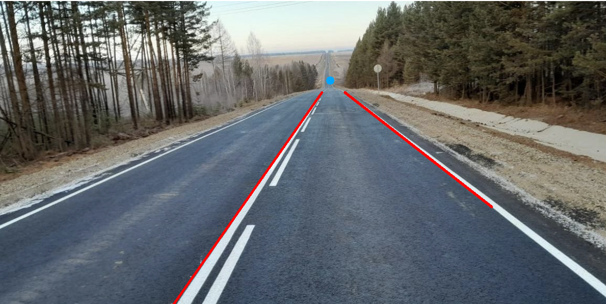

Homework 1
===========

**Find the lanes in the image road1.png and the point of convergence of these parallel lines in the image.**

Run:
```
cd intersecting_road_lines/
python hw1.py
```

Input:
-----------

Result:
-----------

